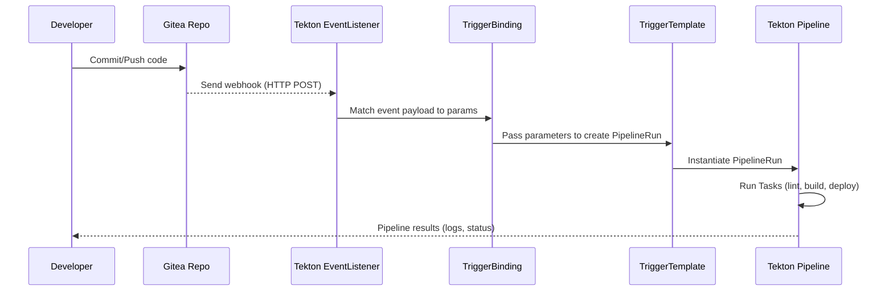

# GITEA + TEKTON-PIPELINES

This showcase demonstrates how to set up Gitea (self-hosted Git service) integrated with Tekton Pipelines in Kubernetes to enable push-to-build workflows.

Key Features
- 🛠 Deploys Tekton Pipelines and Tekton Triggers via Helmfile and Kubernetes manifests
- 📦 Deploys Gitea as the internal Git repository server
- 🔄 Configures a Tekton EventListener to respond to webhook events from Gitea
- ⚡ Automatically triggers CI/CD pipelines on push events in Gitea repositories
- 🔍 Includes manual testing methods for both pipeline execution and webhook triggering



## DEPLOY TEKTON + GITEA

```bash
helmfile apply -f gitea-tekton.yaml
```

## ENABLE TEKTON-TRIGGERS

```bash
# CREATE NAMESPACE
kubectl apply -f resources/trigger-cr.yaml
```

## CREATE NAMESPACE + RBAC

```bash
# CREATE NAMESPACE
kubectl apply -f resources/namespace.yaml

# CREATE RBAC
kubectl apply -f resources/rbac.yaml
```

## CREATE TEKTON PIPELINE-RESOURCES

```bash
# CREATES TASK
kubectl apply -f resources/task.yaml

# CREATES PIPELINE
kubectl apply -f resources/pipeline.yaml
```

## TEST PIPELINERUN

```bash
tkn pipeline start demo-pipeline \
-n tekton-ci \
-p git-repo-url=http://example.com/myrepo.git \
-p git-revision=abc123 \
--showlog
```

## CREATE GITEA TRIGGERING

```bash
# CREATES BINDING FOR INCOMING EVENTS
kubectl apply -f resources/trigger-binding.yaml

# CREATES TEMPLATE FOR CREATING PIPELINERUNS
kubectl apply -f resources/trigger-template.yaml

# CREATES TRIGGER ITSELF
kubectl apply -f resources/trigger.yaml

# CREATES EVENTLISTENER TO LISTEN FOR WEBHOOK EVENTS
kubectl apply -f resources/event-listener.yaml

# CREATES THE EXPOSE OF THE EVENTLISTENER
kubectl apply -f resources/service.yaml
```

## TEST EVENT-TRIGGER (INSIDE CLUSTER)

```bash
kubectl run curltest --rm -i --tty --image=curlimages/curl --restart=Never   -- curl -X POST   -H "Content-Type: application/json"   -d '{
        "after": "abc123def456", # pragma: allowlist secret
        "repository": {
          "clone_url": "http://maverick.tiab.labda.sva.de:30083/gitea_admin/source.git"
        }
      }'   http://el-gitea-listener.tekton-ci.svc.cluster.local

# CHECK FOR PIPELINERUN CREATION
# tkn pr list -n tekton-ci
```

## CONFIGURE GITEA FOR TEKTON TRIGGER

0. Create Repository

1. 📥 Find the EventListener URL (internal or external)
You already used it in your `curl` command:
```bash
http://el-gitea-listener.tekton-ci.svc.cluster.local
````

This URL is only reachable **within the cluster**. If Gitea also runs inside the same cluster, this cluster URL is sufficient.

---

2. 🪝 Configure a Webhook in Gitea

**a)** Go to your repository in Gitea
Path:

```bash
http://<GITEA-URL>/<user>/<repo>/settings/hooks
````


**b)** Choose:
`Add Webhook` → **Gitea** (or **Custom Webhook**)

**c)** Fill in the following:

| Field         | Value                                                       |
|---------------|-------------------------------------------------------------|
| Target URL    | `http://el-gitea-listener.tekton-ci.svc.cluster.local`     |
| Content-Type  | `application/json`                                          |
| Trigger On    | Push Events (or whatever you need)                          |
| Secret        | *(optional, but recommended to verify in Tekton)*          |

---

3. ✅ Test the Webhook

A simple commit/push in your repository should now trigger the Tekton EventListener — just like your manual `curl` test.
